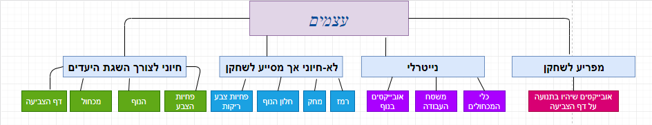
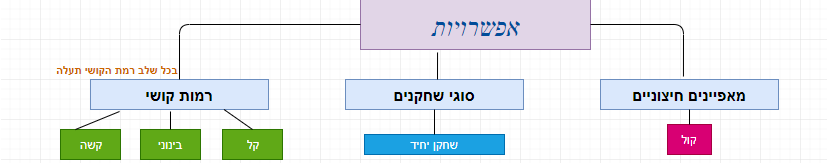
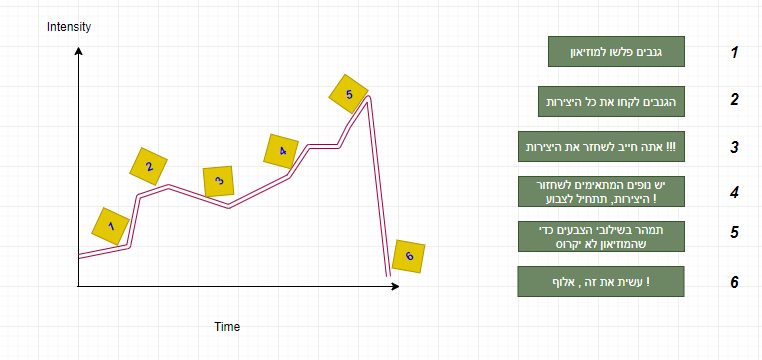
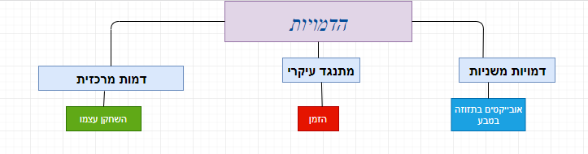

# Mix-It
**ציירו ושלבו בעצמכם את הצבעים המתאימים לטבע**

## מהות המשחק

המשחק מתאים למשתמשי מחשב בגילאי 5-99 שרוצים לשחק וללמוד לצבוע, לצייר ולשלב צבעים.
Mix-It הוא משחק צביעה המאפשר למשתמש לצייר, לצבוע ולשפר את יכולת שילובי הצבעים שלו.
בשונה ממשחקי צביעה אחרים המשלבים רק צביעה או רק ציור, לא ממש חינוכיים וללא משוב על הציור הסופי, המשחק שלנו מאפשר למשתמש לצייר, לצבוע ולשלב צבעים קיימים ליצירת צבעים חדשים, ובנוסף המשחק שלנו נותן משוב למשתמש על רמת הדיוק של הציור ע"י אלגוריתם הבודק התאמת צבע ודיוק.

* המשחק מתאים לפלטפורמות של מחשב רגיל ומשחק באינטרנט .
* המשחק מתאים לכל אדם בגילאי 5-99, לא דרושה רמת כשרון מסוימת, אלא רק כוונה לשחק וללמוד לצייר ולשלב צבעים.
* המשחק מתאים לשחקן אחד, ואולי בהמשך נאפשר משחק רב משתתפים.

---

## פרטי המשחק

### 1. מה רואים?

* איך נראה מסך המשחק?
* מה רואים בגבולות של המסך?
* האם אפשר לעבור את גבולות המסך?
* מה רואים מעבר לגבולות המסך?

הוסיפו ציורי מסך. 

### 2. מה עושים?

* **:תהליך ההתחלה של המשחק**

כבר לאחר שהשחקן ילחץ על המשחק, בזמן טעינת המשחק יופיעו לו שלל צבעים הנמרחים על המסך שיהוו שם המשחק.
התפריט הראשי יהיה ברקע צבעוני תלת מימדי, מוזיקת רקע תתנגן ועכבר השחקן יהיה מכחול.
התפריט יכיל מספר כפתורים: משחק חדש , טבלת תוצאות , לימוד המשחק ויציאה, כאשר לכל כפתור יהיה אייקון של שפורפרת כך שאם הכפתור יילחץ – תהיה השפרצה של צבעים למסך.
בכל פעם שהשחקן יחזיק את העכבר לחוץ כאשר העכבר לא בשטח כפתור, השחקן יצבע את רקע המסך וקול צביעה יתנגן. במידה והשחקן עובר עם העכבר בשטח כפתור, צבע הכפתור ישתנה וגודל הכפתור יגדל מעט.

*	**:תהליך הליבה של המשחק**

כאשר השחקן ילחץ על כפתור 'משחק חדש' , יופיע לו בצד הימני של המסך עמדת ציור עם לוח לבן שבו ציור לא צבוע שאותו יצטרך לצבוע, ובצד השמאלי של המסך יהיה נוף תלת מימדי (שבכל שלב ישתנה) שאותו יצטרך לצייר (כמובן שנמקד את השחקן את מה לצייר) יופיע ציור שהשחקן יצטרך לצייר על הלוח הלבן.
בתחתית המסך, יהיו לשחקן כמה רכיבים שאיתם יוכל לצבוע: בצד השמאלי בתחתית יהיו פחיות צבע עם כמות צבעים מוגבלת ופחיות ריקות (לשילוב צבעים) שאיתם יצטרך לצייר את הציור,  לידם יהיה מחק בעזרתו השחקן יוכל למחוק מה שלא התכוון לצייר ולידו יהיה דלי שבפנים כמה מכחולים בגדלים שונים.
כדי לשלב צבעים, על השחקן ללחוץ על פחית ריקה, ותיפתח לו אפשרות לשפוך צבעים שיש לו לתוך הפחית הריקה, השחקן יגרור את הצבע שרוצה לשלב לפחית הריקה וכך היא תתמלא בצבע משולב שיעמוד לרשותו.
למעלה משמאל יהיה הניקוד של השחקן באותו שלב, כלל שיעלה שלבים בזמנים קצרים יותר – יצבור יותר נקודות.
כדי לעבור שלב, על השחקן להשתמש בכמות הצבעים המוגבלת ובסוגי כלי הצביעה שיעמדו לרשותו על מנת לצבוע את הנוף שמשמאלו בצורה טובה, כך שילחץ על המכחול, יכניס אותו לצבע הרצוי, וילחץ על חלק תחום בדף והחלק ייצבע.
ברגע שהשחקן מרגיש מוכן לבדיקה של הציור, ילחץ על כפתור 'הציור הושלם' ותופיע לו על המסך רמת ההתאמה על הציור שלו וזה מה שיקבע אם עבר לשלב הבא או שמא לא צייר את הנוף כנדרש ויצטרך להישאר באותו שלב.

*	**:תהליך הסיום של המשחק**

ככל שנתקדם בשלבים, הציורים יהיו מורכבים יותר עם שילובי צבעים שונים ולפעמים עם כמות צבעים יותר מוגבלת משלבים קודמים.
כדי לנצח ולסיים את המשחק על השחקן לעבור את כל שלבי המשחק (עוד לא קבענו כמה), כאשר בשלבי הסיום, יצטרך להפגין ידע, דיוק ולמידה משלבים קודמים ומשילובי צבעים שביצע כדי שכל אלה יעזרו לו לצייר את הנוף העומד לרשותו נכון ומדויק.

### 3. מה העצמים?

**עצמים חיוניים לצורך השגת היעדים:**

* דף הצביעה - עליו ניתן לצבוע את הנוף
* מכחול - בעזרתו צובעים את הציור
* הנוף - בעזרתו יודעים מה לצבוע
* פחיות הצבע - בעזרתם ניתן לשלב את הצבעים כדי להתאים לנוף

**עצמים לא חיוניים אך מסייעים לשחקן:**

* פחיות צבע ריקות - ניתן לשפוך אליהן צבעים קיימים כדי לשלב צבעים
* חלון הנוף - בעזרתו ניתן לדעת בדיוק מה לצבוע
* מחק - בעזרתו ניתן למחוק צביעה לא נכונה
* רמז - בעזרתו ניתן לקבל צבע משולב במתנה

**עצמים נייטרלים:**

* אובייקטים בנוף - מוסיפים לאווירת הטבע
* משטח העבודה - עליו כל כלי הצביעה מונחים
* כלי המכחולים - בתוכו מונחים המכחולים

**עצמים המפריעים לשחקן:**

* אובייקטים שיהיו בתנועה על דף הצביעה - יתפסו את תשומת לב השחקן

### 4. מה האפשרויות?

**השחקן לא יוכל לעשות בחירות של רמות קושי במשחק באופן ישיר, אלא בכל שלב רמת הקושי תעלה**

* *ברמת קושי קלה*, בשלבים הראשונים, שילובי הצבעים יהיו יחסית פשוטים עד כדי שילוב 2 צבעים בודדים, ובנוסף - יהיה רמז זמין לשחקן

* *ברמת קושי בינונית*, בשלבים האמצעיים, שילובי הצבעים יהיו קצת יותר מורכבים עד כדי שילוב 2-3 צבעים בודדים אך בעוצמות צבע שונות (באחוזים), ובנוסף - יהיה רמז זמין לשחקן רק אם הגיע למספר נקודות מסוים.

* *ברמת קושי קשה*, בשלבים הסופיים, שילובי הצבעים יהיו מורכבים ומאתגרים עד כדי שילוב 3-4 צבעים בודדים בעוצמות צבע שונות (באחוזים), ובנוסף - יהיה רמז זמין לשחקן רק במידה והצליח לצבוע חלק מהציור הנוכחי באחוזי התאמה גבוהים (מעל 90)

### 5. מה העולם?

* המשחק מתרחש במקום אחר בכל שלב, כאשר הסיבה העיקרית לכך היא לתפוס את תשומת לב השחקן בעזרת נופי טבע

* העולם יהיה סגור ושטוח, כלומר לא יהיה ניתן להסתובב בעולם

* חוקי הפיסיקה יהיו רגילים, אך חוקי הטבע ישתנו קצת בהתאם לאובייקטים הזזים בנוף בכך שתמיד האובייקטים יסתובבו בתוך מסך המשחק (מה שלא קורה תמיד בעולם האמיתי),
ובנוסף - בכל לחיצה על תחימה בציור האזור ייצבע במלואו, מה שגם נוגד את חוקי הטבע

* השחקן לא יוכל לצבוע חלקים שהם לא חלק מהדף שלו והשחקן לא יוכל לזוז - הוא מקובע.
בנוסף, השחקן לא יכול לבדוק את רמת ההתאמה של הציור שלו במידה ולא צבע לפחות חצי מהציור.
עוד חוק הוא שהשחקן לא יכול לשלב יותר מ4 צבעים לתוך פחית צבע ריקה, ולא יכול לשלב יותר מ100% של אותו הצבע

*  תוצאות ייקבעו במשחק בעזרת המגבלה של המשחק המאפשרת לשחקן לצבוע רק בתוך האזורים המסומנים ובעזרת המגבלה שהשחקן לא יכול לסיים את הציור אם לא צבע לפחות חצי ממנו 

### 6.	מה הסיפור?

**סיפור רקע** - ממוזיאן תמונות גדול בעולם נגנבו כל היצירות שצוירו ע"י אמנים גדולים ועל השחקן לצייר מחדש את הציורים שנגנבו

**עלילת המשחק** - שחזור כל היצירות והחזרתם למוזיאון הגדול כך שבכל שלב, היצירה תהיה מורכבת יותר לצביעה 
*   מהי עלילת המשחק - מה קורה במהלך המשחק ואיך השחקן משפיע על העלילה?

### 7.	מי הדמויות?

* הדמות המרכזית ("גיבור המשחק") תהיה השחקן עצמו (הצייר) -תפקידו יהיה לשלב צבעים ולצבוע את הציור הלבן שיקבל תוך הסתכלות על הנוף.
לא יהיה ניתן לראות את השחקן אלא רק את המכחול בו הוא מחזיק.

* ה"מתנגד" העיקרי יהיה הזמן, זו לא באמת דמות אך היא זו שתגרום לשחקן להילחץ ולפעול מהר יותר
 )
 * הדמויות המשניות יהיו אובייקטים שיזוזו בתוך המסך במהלך כל השלב ויהוו בעיקר חוויה ושעשוע

## שלבים במשחק

**שלב ראשון** - השחקן יקבל 3 צבעים בסיסיים (כחול, אדום וצהוב) בתוך פחיות צבע, ופחית צבע אחת ריקה.
בחלק השמאלי של המסך יהיה פרח (המורכב מצבעי כתום, ירוק ואדום) שאותו יצטרך לצבוע ונוף מתאים.
לרשות השחקן יהיו 5 דקות ורמז אחד שיוכל להפעיל במהלך השלב.
* חשוב לציין כי בשלב זה על השחקן לשלב בדיוק 2 צבעים לתוך פחית הצבע הריקה (באחוזים של 50/50) 

**שלב שני** - השחקן יקבל 4 צבעים בסיסיים (כחול, אדום, לבן ושחור) בתוך פחיות צבע, ופחית צבע אחת ריקה.
בחלק השמאלי של המסך יהיה חזיר (המורכב מצבעי ורוד, אפור וכחול) שאותו יצטרך לצבוע ונוף מתאים.
לרשות השחקן יהיו 7 דקות ורמז אחד שיוכל להפעיל במהלך השלב
* חשוב לציין כי בשלב זה על השחקן לשלב בדיוק 2 צבעים לתוך פחית הצבע הריקה (באחוזים שונים עד 66/33)

**שלב שלישי** - השחקן יקבל 4 צבעים בסיסיים (צהוב, אדום, לבן ושחור) בתוך פחיות צבע, ו-2 פחיות צבע אחת ריקות.
בחלק השמאלי של המסך יהיה אפרסק (המורכב מצבעי ורוד, אפור וכחול) שאותו יצטרך לצבוע ונוף מתאים.
לרשות השחקן יהיו 7 דקות ורמז אחד שיוכל להפעיל במהלך השלב
* חשוב לציין כי בשלב זה על השחקן לשלב עד 3 צבעים לתוך פחית הצבע הריקה (באחוזים שונים עד 75/25 או לחלופין 50/25/25)

---

## סקר שוק

* **שם משחק לא ידוע**

תיאור:

בכל שלב המשתמש מקבל כמות צבעים מוגבלת (בתחתית המסך) כך שבאמצע המסך ישנן מספר פחיות ריקות שמתחת לכל אחת מהן יש צבע מסוים שאליו המשתמש צריך להגיע וכדי לעשות זאת הוא יצטרך לשלב את הצבעים שקיבל.
בכל שלב יש לו מספר טעויות שיכול לבצע – אם טעה בפעם האחרונה, הפסיד וחוזר לשלב הראשון. 

המשחק שלנו יהיה יותר מקורי ושחקנים יעדיפו לשחק במשחק שלנו כיוון שהממשק שלנו הרבה יותר נוח למשתמש, המשחק יהיה בתלת מימד לעומת המשחק הזה שנראה קצת מיושן ,
ובנוסף - במשחק שלנו יוצג אחוז ההתאמה של השחקן בעזרת אלגוריתם בעיבוד תמונה.

צילום מסך:

קישור: 

<https://www.youtube.com/watch?v=DDsEcU4UMps&ab_channel=UnboxTherapy>

* **Try-Colors**

תיאור:

בכל שלב – חצי מהמסך צבוע בלבן והחצי השני צבוע בצבע שהמשתמש צריך להגיע אליו, כאשר בתחתית המסך, המשתמש מקבל מספר מוגבל של צבעים אותם צריך לשלב כרצונו כדי להגיע לצבע הרצוי, כך שהוא יכול לשלב צבעים באחוזים מסוימים, כלומר – יכול לשלב לדוגמא: 20 אחוז לבן, 30 אחוז אדום ו50 אחוז כחול לפי כמות האחוזים שנתן לכל צבע, הוא מקבל צבע חדש במקום הצבע הלבן ומופיע לו גם אחוז התאמה. ( אי אפשר להפסיד, המשתמש יכול לנסות ולנסות עד שמגיע לצבע הרצוי). 

המשחק שלנו יהיה יותר מקורי ושחקנים יעדיפו לשחק במשחק שלנו כיוון שהממשק שלנו הרבה יותר נוח למשתמש, המשחק יהיה בתלת מימד לעומת המשחק הזה שנראה קצת מיושן ,
ובנוסף - במשחק שלנו השחקן צובע אובייקט כלשהו מה שנותן חוויה יותר מהנה מאשר לנסות להתאים סתם ריבוע צבוע.

צילום מסך:

קישור: 

<https://trycolors.com/game/>

* **Color Factory**

תיאור:

בכל שלב – ישנו ציור לא צבוע שאותו צריך לבצוע גם כן עם כמות צבעים מוגבלת.
ישנו טקסט המסביר באיזה צבע צריך לצבוע את האובייקט ובחלק העליון של המסך ישנה נוסחא שבעזרתה ניתן להגיע לצבע המבוקש.

המשחק שלנו יהיה יותר מקורי ושחקנים יעדיפו לשחק במשחק שלנו כיוון שהמשחק שלנו יהיה בתלת מימד לעומת המשחק הזה שהוא בדו-מימד ,
ובנוסף - המשחק שלנו יהיה יותר מאתגר וכיפי כיוון שבמשחק הנתון ממש מגלים את הנוסחא ליצירת הצבע מה שהופך את המשחק ל-לא לימודי אלא רק לעקוב אחר הוראות, 
לעומת המשחק שלנו שבו השחקן צריך להפעיל את המחשבה והכשרון היצירתי שלו.

צילום מסך:

קישור: 

<https://www.turtlediary.com/game/color-game.html>

